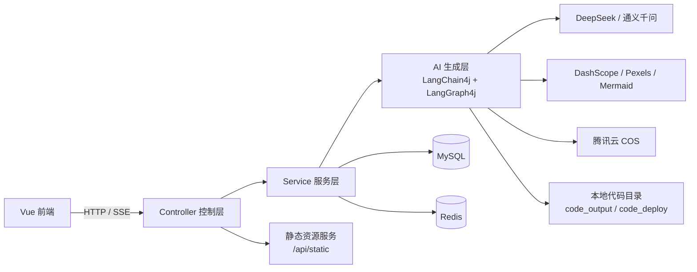
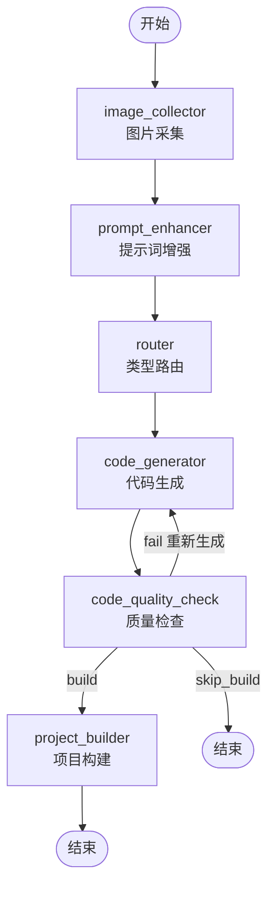

# WebCodeGenerate（灵构 AI · 后端）

<div align="center">

**基于 Spring Boot + LangChain4j + LangGraph4j 的 AI 网页代码生成后端服务**

用自然语言描述你的想法，AI 实时生成网页代码、流式对话迭代、一键部署与下载源码。


</div>

---

## 📖 项目简介

WebCodeGenerate 是一个 **AI 代码生成平台的后端服务**。用户通过自然语言描述需求，系统借助大模型（DeepSeek / 通义千问）自动生成网页代码，支持三种生成模式，并通过 SSE 流式返回生成过程。生成完成后可实时预览、一键部署到云端、下载完整源码。

配套前端项目见 [`frontend/`](frontend/README.md)（Vue 3 + TypeScript + Ant Design Vue）。

## ✨ 核心功能

- 💬 **AI 对话式代码生成**：基于 SSE（Server-Sent Events）实时流式返回生成内容与过程。
- 🧭 **三种代码生成模式**：
  - `html` — 原生 HTML 单页
  - `multi_file` — 原生多文件应用
  - `vue_project` — 完整 Vue 工程（工具调用 + 自动构建）
- 🤖 **智能路由**：根据用户提示词自动选择最合适的代码生成类型。
- 🕸 **LangGraph4j 多智能体工作流**（Agent 模式）：
  图片采集 → 提示词增强 → 路由 → 代码生成 → 质量检查 → 项目构建，并支持质检失败自动重试。
- 🚀 **应用全生命周期管理**：创建、编辑、删除、列表查询、精选推荐（管理员）。
- 🌐 **一键部署 + 静态预览**：生成 deployKey，通过 `/api/static/{deployKey}` 访问，并异步生成网页截图作为封面。
- 📦 **源码下载**：将生成代码打包为 ZIP 下载。
- 👤 **用户体系**：注册 / 登录 / 注销（Session 存 Redis）、角色权限（user / admin）。
- 💾 **对话历史**：游标分页查询，多轮上下文记忆。
- 🛡 **安全与稳定性**：接口限流（Redisson 分布式限流）、Prompt 安全护栏、AOP 权限校验。
- 📊 **可观测性**：Spring Boot Actuator + Prometheus 指标，AI 模型调用指标采集。
- 📚 **API 文档**：Knife4j（基于 springdoc-openapi）自动生成接口文档。

## 🛠 技术栈

| 分类 | 技术 |
| --- | --- |
| 基础框架 | Spring Boot 3.5.3、Java 21 |
| AI 框架 | LangChain4j 1.1.0、LangGraph4j 1.6.0-rc2 |
| 大模型 | DeepSeek（deepseek-chat / deepseek-reasoner）、通义千问 qwen-turbo（路由分类） |
| 图像生成 | 阿里云 DashScope（wan2.2-t2i-flash）、Pexels 图库、Mermaid CLI |
| ORM | MyBatis-Flex 1.11.0 |
| 数据库 | MySQL 8.0 |
| 缓存 / 会话 / 限流 | Redis、Spring Session Redis、Redisson 3.50.0、Caffeine |
| 对象存储 | 腾讯云 COS |
| 网页截图 | Selenium 4 + WebDriverManager |
| API 文档 | Knife4j 4.4.0（springdoc-openapi） |
| 监控 | Spring Boot Actuator、Micrometer + Prometheus |
| 工具 | Hutool、Lombok |

## 🏗 架构设计

### 整体架构



### Agent 模式工作流（LangGraph4j）



## 📁 项目结构

```
src/main/java/com/marcuschu/webcodegenerate/
├── WebCodeGenerateApplication.java   # 启动类
├── ai/                               # AI 代码生成核心
│   ├── core/                         # 门面、流处理、解析器、保存器、Vue 构建
│   ├── guardrail/                    # Prompt 安全护栏
│   ├── message/                      # 流式消息模型
│   ├── model/                        # 代码生成结果模型
│   └── tools/                        # 文件读写/删除等工具
├── annotation/                       # @AuthCheck、@RateLimit 注解
├── aop/                              # 权限校验、限流切面
├── common/                           # 统一响应、分页、工具
├── config/                           # CORS、Redis、COS、模型、Redisson 等配置
├── constant/                         # 常量定义
├── controller/                       # App / User / ChatHistory / StaticResource / Health
├── exception/                        # 错误码、业务异常
├── langgraph4j/                      # LangGraph4j 工作流
│   ├── node/                         # 工作流节点
│   ├── state/                        # 工作流状态
│   ├── tools/                        # 图片/Logo/图示/Mermaid 工具
│   └── service/                      # 图片采集、质检等服务
├── mapper/                           # MyBatis-Flex Mapper
├── model/                            # entity / enums / request / vo
├── monitor/                          # AI 模型指标采集与监听
├── service/                          # 业务服务接口与实现
└── utils/                            # COS、网页截图、代码生成器等工具

src/main/resources/
├── application.yml                   # 基础配置
├── application-prod.yml              # 生产配置（请勿提交敏感信息）
├── mapper/                           # MyBatis XML
├── prompt/                           # 各类系统提示词
└── sql/create_table.sql              # 数据库初始化脚本
```

## 🚀 快速开始

### 环境要求

| 依赖 | 版本 |
| --- | --- |
| JDK | 21 |
| Maven | 3.9+（或使用项目自带 `mvnw`） |
| MySQL | 8.0 |
| Redis | 6+ |

### 1. 初始化数据库

执行项目内的初始化脚本：

```bash
mysql -u root -p < src/main/resources/sql/create_table.sql
```

该脚本会创建 `marcus_ai_code` 库及 `user`、`app`、`chat_history` 三张表。

### 2. 配置

复制并修改配置（推荐使用环境变量注入，**不要提交真实密钥**）：

```bash
export SPRING_DATASOURCE_URL="jdbc:mysql://localhost:3306/marcus_ai_code"
export SPRING_DATASOURCE_USERNAME="root"
export SPRING_DATASOURCE_PASSWORD="你的MySQL密码"

export SPRING_DATA_REDIS_HOST="localhost"
export SPRING_DATA_REDIS_PORT="6379"
export SPRING_DATA_REDIS_PASSWORD=""        # 无密码则留空

export LANGCHAIN4J_OPEN_AI_CHAT_MODEL_API_KEY="你的 DeepSeek API Key"
export LANGCHAIN4J_OPEN_AI_STREAMING_CHAT_MODEL_API_KEY="你的 DeepSeek API Key"
export LANGCHAIN4J_OPEN_AI_REASONING_STREAMING_CHAT_MODEL_API_KEY="你的 DeepSeek API Key"
export LANGCHAIN4J_OPEN_AI_ROUTING_CHAT_MODEL_API_KEY="你的 DashScope API Key"

export DASHSCOPE_API_KEY="你的 DashScope API Key"   # 图像生成
export PEXELS_API_KEY="你的 Pexels API Key"         # 图片搜索
export COS_CLIENT_SECRETID="你的腾讯云 SecretId"     # 截图上传
export COS_CLIENT_SECRETKEY="你的腾讯云 SecretKey"
```

> 详细配置项见 [⚙️ 配置说明](#️-配置说明)。

### 3. 启动

使用 Maven Wrapper：

```bash
# Linux / macOS
./mvnw spring-boot:run

# Windows
mvnw.cmd spring-boot:run
```

或打包后运行：

```bash
./mvnw clean package -DskipTests
java -jar target/webcodegenerate-0.0.1-SNAPSHOT.jar --spring.profiles.active=prod
```

### 4. 验证

服务默认端口 `8123`，接口统一前缀 `/api`：

```bash
curl http://localhost:8123/api/health/
# {"code":0,"data":"ok","message":"ok"}
```

- **API 文档（Knife4j）**：http://localhost:8123/api/doc.html
- **OpenAPI JSON**：http://localhost:8123/api/v3/api-docs

## ⚙️ 配置说明

关键配置项（`application.yml`）：

| 配置项 | 说明 | 默认值 |
| --- | --- | --- |
| `server.port` | 服务端口 | `8123` |
| `server.servlet.context-path` | 接口统一前缀 | `/api` |
| `spring.datasource.*` | MySQL 连接信息 | — |
| `spring.data.redis.*` | Redis 连接信息 | `localhost:6379` |
| `spring.session.store-type` | 会话存储方式 | `redis` |
| `langchain4j.open-ai.chat-model.*` | 普通对话模型（deepseek-chat） | — |
| `langchain4j.open-ai.streaming-chat-model.*` | 流式对话模型（deepseek-chat） | — |
| `langchain4j.open-ai.reasoning-streaming-chat-model.*` | 推理模型（deepseek-reasoner） | — |
| `langchain4j.open-ai.routing-chat-model.*` | 路由分类模型（qwen-turbo） | — |
| `dashscope.api-key` | 阿里云 DashScope 图像生成 | — |
| `pexels.api-key` | Pexels 图片搜索 | — |
| `cos.client.*` | 腾讯云 COS 对象存储 | — |
| `mermaid.cli-path` | Mermaid CLI 可执行文件路径 | `mmdc` |
| `app.deploy.base-url` | 部署访问基础地址（local 默认 `http://localhost:8123/api/static`；prod 默认 `http://对外IP/api/static`，均可由 `APP_DEPLOY_BASE_URL` 覆盖） | 见 profile |

> ⚠️ **安全提醒**：所有密钥请通过环境变量或配置中心注入，切勿将真实密钥提交到 Git 仓库。

## 📡 主要接口

统一响应结构：

```json
{ "code": 0, "data": { }, "message": "ok" }
```

| 模块 | 方法 | 路径 | 说明 |
| --- | --- | --- | --- |
| 用户 | POST | `/api/user/register` | 用户注册 |
| 用户 | POST | `/api/user/login` | 用户登录 |
| 用户 | POST | `/api/user/logout` | 用户注销 |
| 用户 | POST | `/api/user/list/page/vo` | 分页查询用户（管理员） |
| 应用 | POST | `/api/app/add` | 创建应用 |
| 应用 | POST | `/api/app/update` | 更新应用（仅本人） |
| 应用 | POST | `/api/app/delete` | 删除应用 |
| 应用 | GET | `/api/app/get/vo` | 查询应用详情 |
| 应用 | POST | `/api/app/my/list/page/vo` | 我的应用分页列表 |
| 应用 | POST | `/api/app/good/list/page/vo` | 精选应用分页列表 |
| 应用 | POST | `/api/app/deploy` | 部署应用 |
| 应用 | GET | `/api/app/download/{appId}` | 下载应用源码（ZIP） |
| 应用 | GET | `/api/app/chat/gen/code` | AI 对话生成代码（**SSE**） |
| 对话 | GET | `/api/chatHistory/app/{appId}` | 查询应用对话历史（游标分页） |
| 静态 | GET | `/api/static/{deployKey}/**` | 静态资源预览 |
| 健康 | GET | `/api/health/` | 健康检查 |

管理端接口（需 `admin` 角色）统一使用 `/api/*/admin/*` 前缀，详见 Knife4j 文档。

## 🗄 数据库设计

| 表 | 说明 | 主要字段 |
| --- | --- | --- |
| `user` | 用户 | userAccount、userPassword、userName、userAvatar、userRole、isDelete |
| `app` | 应用 | appName、cover、initPrompt、codeGenType、deployKey、priority、userId、isDelete |
| `chat_history` | 对话历史 | parentId、message、messageType（user/ai）、appId、userId、isDelete |

详见 [`src/main/resources/sql/create_table.sql`](src/main/resources/sql/create_table.sql)。

## 📦 打包与部署

```bash
# 打包（跳过测试）
./mvnw clean package -DskipTests

# 运行
java -jar target/webcodegenerate-0.0.1-SNAPSHOT.jar --spring.profiles.active=prod
```

> 生产部署时建议通过 Nginx 反向代理 `/api` 到本服务 `8123` 端口，并注意：
> - `/api/app/chat/gen/code` 为 SSE 长连接，需关闭缓冲：`proxy_buffering off;`、`proxy_read_timeout 300s;`
> - 生成页面与部署页面通过 `/api/static/**` 提供静态服务。

## 🔗 关联项目

- [前端项目（灵构 AI · Vue 3）](frontend/README.md)

## 📄 许可证

本项目暂未包含 LICENSE 文件，版权归作者所有。如需使用或二次开发，请联系作者。

## ⚠️ 注意事项

1. 应用生成依赖大模型 API，需要有效的 DeepSeek / DashScope API Key。
2. 部署、截图封面依赖腾讯云 COS 与 Selenium 环境（需可用的 Chrome 或 WebDriver）。
3. Mermaid 图示生成依赖本机 `mmdc`（Mermaid CLI），可通过 `MERMAID_CLI_PATH` 指定路径。
4. 请勿将 `application-prod.yml` 中的真实密钥提交到公开仓库。
